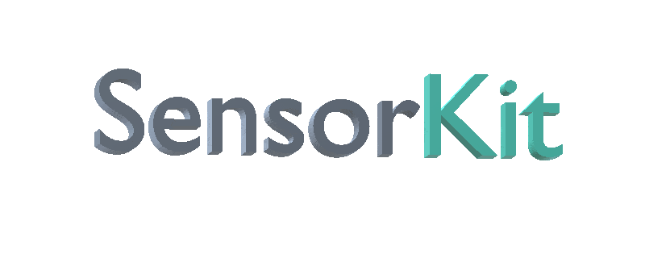
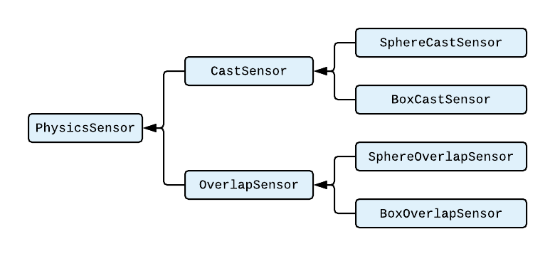

Утилитарные компоненты для работы с Raycast'ами как с игровыми обьектами

# Зачем нужна
Эта библиотека оборачивает методы Physics.**X**Cast and Physics.Overlap**X** в MonoBehavior, и превращает игровой обьект в конфигурируемый сенсор.
Благодаря ей можно писать код который меньше думает о том как стрельнуть луч, и больше о том, как реагировать если луч куда то попал.

# Особенности
* **Выносит логику работы с cast'ами и overlap'ами в отдельный класс.**
* **Несколько уровней наследования позволяет абстрагировать тип сенсора (Cast или Overlap) и его форму (Луч, Сфера, Капсула, Куб).**
* **Спроектирована для встраивание в существующую логику**
* **Корректно применяет на себя все transform'ы, так же, как это бы делал коллайдер.**
* **Детальное Gizmo для того чтобы видеть абсолютно всю информацию о том, как себя поведёт каст.**
* **Автоматический выбор метода в зависимости от настроек сенсора.**
* **В случае если желаемое количество детектов > 1, используются NonAlloc версии методов с переиспользуемым массивом.**
* **Можно анимировать параметры каста при помощи аниматора, как и любой другой обьект**

---

# Использование
- Добавьте на сцену нужный компонент и настройте параметры детекта
   - **SphereCastSensor** | **BoxCastSensor** | **SphereOverlapSensor** | **BoxOverlapSensor**
- Добавьте своему игровому обьекту поле того же типа, присвойте туда этот сенсор
- Вызывайте `UpdateSensor()` когда нужно сделать новый каст/overlap
- Используйте полученную информацию как угодно

```CS
public class SensorTest : MonoBehaviour
{
    public CastSensor groundSensor;

    public void Update()
    {
        groundSensor.UpdateSensor();
        
        if (groundSensor.HasHit)
        {
            var normal = groundSensor.RayHit.normal;
            // ground movement logic
        }
        else
        {
            // airborn movement logic
        }
    }
}
```

# Архитектура
Библиотека спроектирована таким образом, чтобы дать возможность быстро итерировать логику связанную с Cast'ами и Overlap'ами, и быстро переключаться между различными способами взаимодействия с физическим миром не модифицируя при этом код.


###### Ray/Capsule касты отсутствуют, потому что являются производными от SphereCast'а. В случае если Radius = 0, используется RayCast, а в случае если Width > 0, используется CapsuleCast. Похожая логика используется и для Overlap'ов

Каждый из уровней наследования предлагает функционал, который позволит получать общую информацию о детекте независимо от типа сенсора. Таким образом например, в случае если необходимо всего лишь детектить присутствие какого то обьекта, PhysicsSensor позволит получать общую информацию независимую от типа сенсора (Есть ли попадание и список обьектов). Для кардинальной смены логики, например смены BoxOverlap на SphereCast, не потребуется изменять оригинальный исходник, а просто поменять ссылку на сенсор.

Сенсор не обновляется сам по себе, и для его обновления необходимо вызывать `UpdateSensor()`. На это есть несколько причин:
- Все игровые обьекты используют касты внутри своей логики, и невозможно предугадать в какое время и месте они это сделают.
- Каст может происходить не каждый кадр
- Иногда необходимо сделать каст, и хранить результат

# Параметры
Сорян, русская документация служит черновиком для английской, а параметры я описывал сразу там, ну в общем там глянь

# Требования
Unity **2018.1** или выше

# Установка

* **Git**: 
    В случае если у вас версия Unity 2018.1 и выше и установлен git, можете добавить строчку в **Packages\manifest.json**
    ```
    "ru.threedisevenzeror.sensorkit": "https://github.com/3DI70R/SensorKit.git"
    ```
    И все компоненты будут загружены и подключены как модуль, не засоряя папку проекта.

* **Как пакет**:
Просто скачайте этот репозиторий как Zip, распакуйте, и в Package Manager'е выберите "Add package from disk..." указав "package.json"

В противном случае, можно просто скопировать файлы из `Assets/Scripts/Runtime` и вставить в проект, некрасиво, лениво, зато быстро

# Changelog
* 1.0.0
    - Первая версия
* 1.1.0
    - Фича: Поддержка переопределения PhysicsScene для каста в другой сцене
    - Фича: Поддержка переопределения направления луча для Cast сенсоров, для возможности кастить фигуры направленные в сторону отличную от луча
    - Багфикс: RayCast/SphereCast/CapsuleCast считали собственный Ray вместо посчитанного заранее
* 1.1.1
    - Багфикс: NullReference при активации Gizmos в GameView
* 1.1.2
    - Багфикс: CastSensor хранил **static** массив. Это прямо таки большой и жирный баг который как то прошёл мимо меня. Сорян. (Хранился только последний результат каста и данные терялись если их не использовать до следующего вызова)
    - Багфикс: На 2019.3 текст в окошке Gizmo был немного обрезан из за обновлённого UI